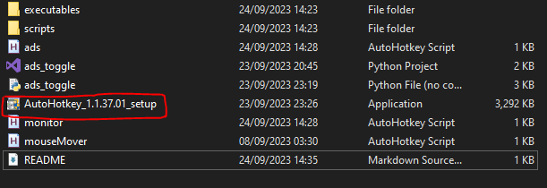
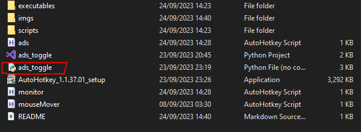
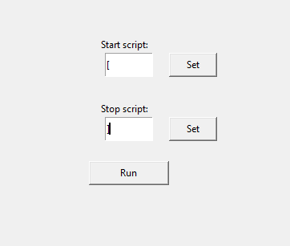

# ads_toggle
Simple program designed to give you the ability to toggle ADS (aim down sights) in games that only support the "hold down button" method

Windows only. Such is the limitation of AHK.

Requires AHK (AutoHotKey). Setup is included in this repo. 

## Instructions:

1. Download the repository
2. If you don't have AHK (chances are you don't), run the setup (it is the tiniest of installs :D )

3. Run 'ads_toggle'

4. Set the key that you will use to turn on the script and the key to shut it off (once it's shut down it can be turned on again by pressing the "turn on" key again)
5. Click "Run"

